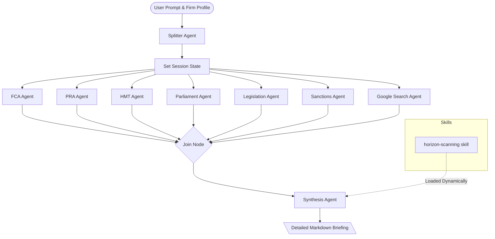

# UK Regulatory & Financial Horizon Scanning Agent

A sophisticated, multi-agent AI assistant built using the **Google Agent Development Kit (ADK)** and designed to run on the **Gemini Enterprise Agent Platform**.

This agent automates the systematic tracking, analysis, and strategic impact assessment of emerging UK financial regulations, legislative updates, and sanctions. It translates raw regulatory text into highly actionable operational guidance tailored to specific firm profiles.

---

## 1. Why Horizon Scanning is Critical

Modern financial institutions operate in a complex, fast-moving regulatory landscape. Regulatory changes from bodies like the FCA, PRA, and HM Treasury occur continuously. Manual tracking leads to:
* **Compliance Lag**: Delayed response to new rulebooks, exposing firms to heavy fines and censures.
* **Lack of Actionability**: Compliance departments struggle to translate high-level policy papers into concrete changes for specific business lines.
* **Siloed Risk Views**: Failure to cross-reference overlapping or contradicting mandates across multiple authorities (e.g., UK GDPR breach reporting vs. Bank of England operational resilience).

This Horizon Scanning Agent addresses these issues by **connecting the dots** between raw text feeds and firm-specific operational impact.

---

## 2. Agent Architecture & Patterns

The agent is designed using enterprise-grade architecture patterns provided by the Google ADK:



### Key Architectural Patterns:
* **Multi-Agent Orchestration (Parallel Workflows)**: The `root_agent` uses ADK's `Workflow` API to execute domain-specific subagents in parallel. This fanning-out pattern keeps context windows focused, prevents tool collision, and reduces overall latency.
* **Join Node Synchronization**: A `JoinNode` blocks execution until all parallel feeds and web searches have finished, fanning the data back in for synthesis.
* **Progressive Disclosure (Skills)**: Rather than bloating the system prompt, the orchestrator dynamically loads the `horizon-scanning` skill instructions and tools for the `synthesis_agent` only when the final briefing needs to be generated.
* **Grounding**: The `google_search` tool is integrated into an isolated node, allowing the agent to retrieve historical documents, definitions, and verify citations on the web without disabling automatic function calling for internal tools.

---

## 3. Data Sources & Functions

The agent connects to the following key data sources:

| Source | Type | Function | Regulatory Importance |
|---|---|---|---|
| **Financial Conduct Authority (FCA)** | RSS News Feed & Scraper | Fetches policy statements, speeches, and consultation papers. | Prime regulator for conduct of business and market oversight in the UK. |
| **Prudential Regulation Authority (PRA)** | RSS Publications Feed & Scraper | Fetches updates on capital adequacy, liquidity, and operational resilience. | Regulator responsible for the prudential regulation and supervision of banks and insurers. |
| **HM Treasury (HMT)** | Atom Feed & Scraper | Monitors government policy announcements, consultations, and draft bills. | Sets the legislative and economic framework for the UK financial sector. |
| **UK Parliament** | REST API & Scraper | Queries the official Bills API for live updates on draft legislation (e.g., AI Bill). | Pre-empts statutory changes before they are passed into law. |
| **UK Legislation** | REST Feed & Scraper | Retrieves details of newly enacted statutes and Statutory Instruments. | The official statute book containing legally binding acts. |
| **OFSI / FCDO Sanctions List** | Daily CSV Download & Parser | Downloads and parses the consolidated daily list of targets under UK sanctions regimes. | Absolute, zero-tolerance compliance requirements for financial crime prevention. |

---

## 4. How to Run Locally

### Prerequisites
* Python 3.13
* [uv](https://github.com/astral-sh/uv) (fast Python package installer and resolver)
* Google Cloud project with Vertex AI API enabled (authenticated via Application Default Credentials)

### Setup & Installation
1. Install dependencies:
   ```bash
   uv sync --dev --extra eval
   ```
2. Authenticate with Google Cloud:
   ```bash
   gcloud auth application-default login
   ```
3. Set your target Google Cloud project (required for Vertex AI grounding/search and billing):
   ```bash
   export GOOGLE_CLOUD_PROJECT="your-gcp-project-id"
   ```

### Running Unit Tests
Verify that all tool logic compiles and runs successfully:
```bash
uv run pytest
```

### Running the Local Playground
To interact with the agent using a web interface:
```bash
PYTHONPATH=. uv run agents-cli playground
```
Once started, open your browser and navigate to:
**http://127.0.0.1:8080/dev-ui/?app=app**

---

## 5. Deployment & Publishing

Once tested locally, you can deploy and publish the agent to the Gemini Enterprise Agent Platform.

### 1. Deploy the Agent Code
To package and deploy the agent container to the runtime:
```bash
PYTHONPATH=. uv run agents-cli deploy
```

### 2. Register/Publish the Agent
To register your agent and make it available in the Gemini Enterprise Agent catalog:
```bash
PYTHONPATH=. uv run agents-cli publish gemini-enterprise
```

---

## 6. Evaluation & Testing

The project contains a sequential evaluation harness located in `run_local_eval.py` that assesses the quality and accuracy of the generated briefings using LLM-as-a-judge.

1. **Generate Evaluation Traces**:
   ```bash
   PYTHONPATH=. uv run agents-cli eval generate --project $GOOGLE_CLOUD_PROJECT --dataset tests/eval/datasets/regulatory_eval.json
   ```
2. **Grade the Traces**:
   ```bash
   PYTHONPATH=. uv run python run_local_eval.py
   ```

### Evaluation Criteria:
* `custom_response_quality`: Assesses whether the output is structured, detailed, professional, and tailored to the firm profile.
* `compliance_accuracy`: Validates that all references, dates, names, and enforcement actions are factually correct and match the underlying sources.

---

## 7. Sample Prompts

You can test the agent in the playground or evaluation harness using the following prompt categories:

### A. Direct Impact & Actionability
* *"Summarize the FCA's Policy Statement published this morning on the Consumer Duty. What are the top three concrete changes a **retail wealth management firm** needs to implement before next quarter?"*
* *"Scan the latest PRA consultations. Are there any upcoming revisions to capital adequacy or liquidity requirements that will affect **mid-tier digital banks** in the UK?"*

### B. Cross-Reference & Contradiction Alerts
* *"Cross-reference the newly introduced UK Parliament Artificial Intelligence Bill with existing FCA guidance on algorithmic trading. Are there conflicting requirements regarding accountability, or does one authority defer to the other?"*
* *"Look at the latest information security updates from the ICO regarding UK GDPR and compare them with the operational resilience rules issued by the Bank of England. Do we have overlapping reporting deadlines if a data breach occurs?"*

### C. Financial Crime & Sanctions Triggers
* *"Analyze the OFSI sanctions list update from today. Highlight any newly designated entities or individuals that intersect with our standard sector exposure in maritime trade finance."*
